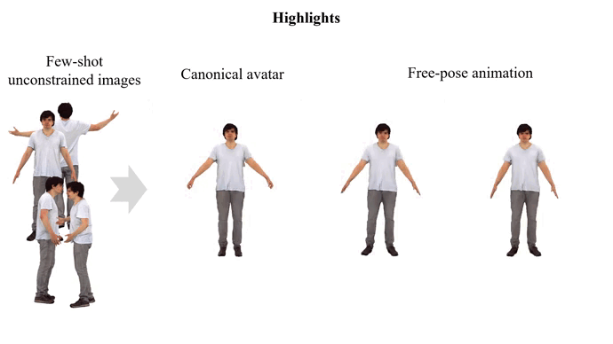

<div align="center">

<h1>HAVE-FUN: Human Avatar Reconstruction from Few-Shot Unconstrained Images</h1>

<div>
Xihe Yang<sup>*</sup>&emsp;Xingyu Chen<sup>*&dagger;</sup>&emsp;Daiheng Gao&emsp;Shaohui Wang&emsp;Xiaoguang Han&emsp;Baoyuan Wang<sup>&dagger;</sup>
</div>
<div>
    Xiaobing.AI&emsp;
    SSE, CUHKSZ&emsp;
    FNii, CUHKSZ&emsp;
    Tsinghua University&emsp;<br>
    <sup>*</sup>equal contribution&emsp;
    <sup>&dagger;</sup>corresponding author 
</div>

<div>
   <strong>CVPR 2024</strong>
</div>

<div>
<a target="_blank" href="https://arxiv.org/abs/2311.15672">
  
</a>

</div>

<div style="width: 70%; text-align: center; margin:auto;">
    <br>
    <em>Our HaveFun framework can create animatable human avatars from few-shot unconstrained images.</em>
</div>

:open_book: For more visual results, go checkout our <a href="https://seanchenxy.github.io/HaveFunWeb/" target="_blank">project page</a>

This repository will contain the official implementation of _HAVE-FUN: Human Avatar Reconstruction from Few-Shot Unconstrained Images_.

<div align="left">

## :mega: Updates
[5/2024] Training and inference codes for XHumans and DART are released.

## :desktop_computer: Requirements
```bash
    conda create --name havefun python=3.8
    conda activate havefun
    pip install -r requirements.txt
```

## Set up Dataset
<!-- --- -->

We release hand dataset benchmarks, [FS-DART](https://drive.google.com/drive/folders/1QK9yuyqAf6IAujTZGVTqv7jh7z4uPMrP?usp=sharing). FS-DART is a synthetic dataset based on the [DART](https://dart2022.github.io/). Checkout the original dataset for Licensing Information. We will release FS-Human later to meet the licensing requirements of XHuman(https://skype-line.github.io/projects/X-Avatar/).

Put the download data under data with following folder structure
```
./
├── ...
└── data
    ├── FS-DART
        └── training
        └── init
        └── driving
```

## Download SMPL Models

Register and download SMPLX models [here](https://smpl-x.is.tue.mpg.de/), MANO models[here](https://mano.is.tue.mpg.de/). Put the downloaded models in the folder smpl_models. The folder structure should look like

```
./
├── ...
└── models
    ├── smplx
    ├── mano
```
## Download pre-trained models
We use Zero-1-to-3 as guidance model to constrain the unseen view generation.

* [Zero-1-to-3](https://github.com/cvlab-columbia/zero123) for diffusion backend.
    We use `zero123-xl.ckpt` by default, and it is hard-coded in `guidance/zero123_utils.py`.
    ```bash
    cd pretrained_dfmodel/zero123
    wget https://zero123.cs.columbia.edu/assets/zero123-xl.ckpt
    ```
For DMTet, we port the pre-generated `32/64/128` resolution tetrahedron grids under `tets`.
The 256 resolution one can be found [here](https://drive.google.com/file/d/1lgvEKNdsbW5RS4gVxJbgBS4Ac92moGSa/view?usp=sharing).


## Training command on FS-XHumans dataset
```
./scripts/body_experiments/train.sh dataset identity gender N_view lambda_sds
eg.
./scripts/body_experiments/train.sh FS-Humans 016 male 4view 0.01
```
### drive
```
./scripts/body_experiments/drive.sh dataset identity gender N_view pose_target pose_take pose_size view_angle
eg.
sh scripts/body_experiments/drive.sh FS-Humans 016 male 4view 025 7 150 360
```
### generate rotated Apose/Tpose
```
./scripts/body_experiments/supl.sh dataset identity gender N_view
eg.
./scripts/body_experiments/supl.sh FS-Humans 016 male 4view
```


## Training command on FS-DART dataset
### train one exp
```
bash scripts/dart_experiments/train_one_exp.sh identity N_view sds_scale
eg. 
bash scripts/dart_experiments/train_one_exp.sh 3 2 0.05
bash scripts/dart_experiments/train_one_exp.sh 3 4 0.03
bash scripts/dart_experiments/train_one_exp.sh 3 8 0.01
```

### drive one exp
```
bash scripts/dart_experiments/drive_one_exp.sh 0 2view
```


## Citation
<!-- --- -->

If you find the codes of this work or the associated FS-Human/DART dataset helpful to your research, please consider citing:

```bibtex
@article{bib:havefun,
    title={HAVE-FUN: Human Avatar Reconstruction from Few-Shot Unconstrained Images},
    author={Yang, Xihe and Chen, Xingyu and Gao, Daiheng and Wang, Shaohui and Han, Xiaoguang and Wang, Baoyuan},
    booktitle={Proceedings of the IEEE/CVF Conference on Computer Vision and Pattern Recognition (CVPR)},
    year={2024}
}
```

## :newspaper_roll: License

See `LICENSE` for more information.

## :raised_hands: Acknowledgements

This work is based on the following amazing opensource projects, thanks a lot to all the authors for sharing!

* [DreamFusion: Text-to-3D using 2D Diffusion](https://dreamfusion3d.github.io/)
    ```
    @article{poole2022dreamfusion,
        author = {Poole, Ben and Jain, Ajay and Barron, Jonathan T. and Mildenhall, Ben},
        title = {DreamFusion: Text-to-3D using 2D Diffusion},
        journal = {arXiv},
        year = {2022},
    }
    ```
* [Zero-1-to-3: Zero-shot One Image to 3D Object](https://github.com/cvlab-columbia/zero123)
    ```
    @misc{liu2023zero1to3,
        title={Zero-1-to-3: Zero-shot One Image to 3D Object},
        author={Ruoshi Liu and Rundi Wu and Basile Van Hoorick and Pavel Tokmakov and Sergey Zakharov and Carl Vondrick},
        year={2023},
        eprint={2303.11328},
        archivePrefix={arXiv},
        primaryClass={cs.CV}
    }
    ```
* [Stable-dreamfusion: Text-to-3D with Stable-diffusion](https://github.com/ashawkey/stable-dreamfusion)
    ```
    @misc{stable-dreamfusion,
        Author = {Jiaxiang Tang},
        Year = {2022},
        Note = {https://github.com/ashawkey/stable-dreamfusion},
        Title = {Stable-dreamfusion: Text-to-3D with Stable-diffusion}
    }
    ```
